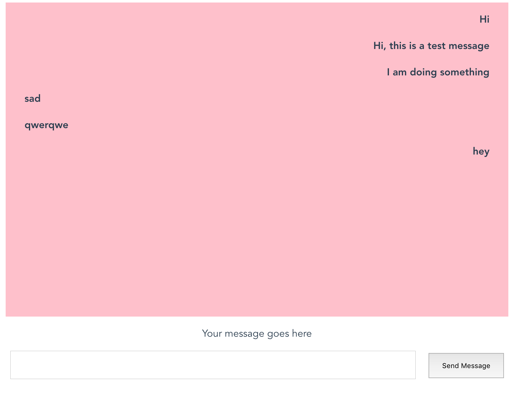
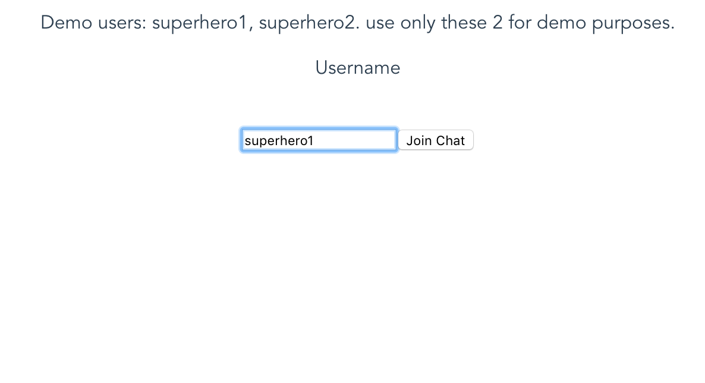

# Build a realtime chat app with vuejs

Read the full tutorial here:

[**>> Build a realtime chat app with vuejs**](https://paper.dropbox.com/doc/Build-a-modern-Android-chat-app-with-Kotlin--AXnKQvBG15aDT9uHJiOgeIblAg-RkqBGaoZOAfzHR1ARj3Hs)

This demo app shows how to build a Realtime group chat app with VueJs:

 

## Running the demo

To run the demo follow these steps:

1. [Create a CometChat account](https://app.cometchat.com) if you haven't already
2. From the [dashboard](https://app.cometchat.com/#/apps), create a new app called "VueJs Group Chat"
3. One created, click **Explore**
4. Go to the **API Keys** tab and click **Create API Key**
5. Create an API key called "VueJs Group Chat Key" with **Full Access**
4. Download the repository [here](https://github.com/bookercodes/kotlin-group-chat/archive/master.zip) or by running `git clone https://github.com/arthlimchiu/CometChatPro-Tutorial.git` and open it in Visual Studio Code
5. Update [config.js](https://github.com/bookercodes/kotlin-group-chat/blob/master/src/config.js) with your newly-created `appID` and `apiKey`
6. `npm run serve` to run the app and login with one of the test users: superhero1, superhero2, superhero3, superhero4 or superhero5

Questions about running the demo? [Open an issue](https://github.com/bookercodes/kotlin-group-chat/issues). We're here to help ✌️

## Useful links

- 🏠 [CometChat Homepage](https://cometchat.com/pro)
- 🚀 [Create your free account](https://app.cometchat.com/#/register)
- 📚 [Documentation](https://prodocs.cometchat.com/docs)
- 👾 [GitHub](https://github.com/CometChat-Pro)

## Useful examples

* [Complete Kotlin team chat app with voice and video calling](https://github.com/cometchat-pro/android-kotlin-chat-app)

